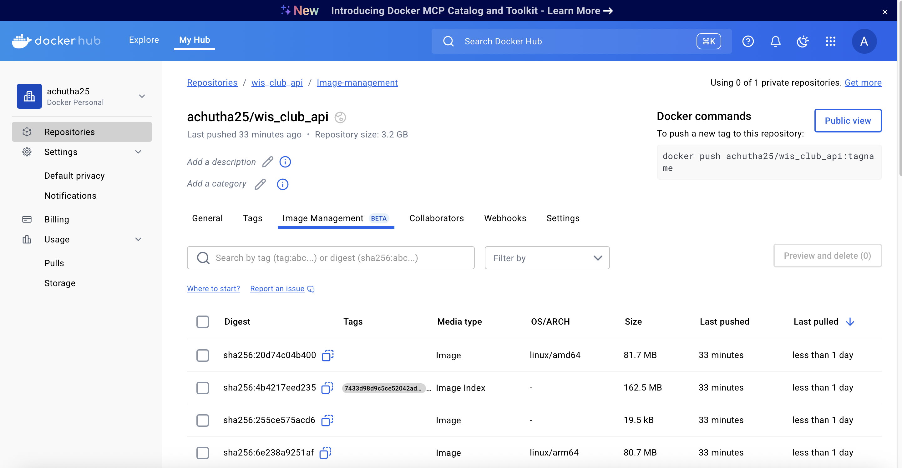
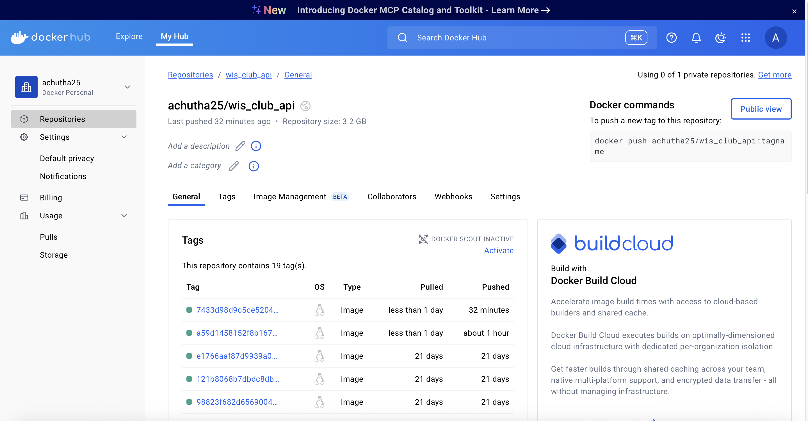

##  Overview

This project is a FastAPI-based web service for user management, built with modern asynchronous Python technologies. It integrates PostgreSQL as the backend database and uses SQLAlchemy with async support for efficient, non-blocking operations. The application includes features like user registration, authentication, profile management, and role-based access control (e.g., upgrading users to professional status). For testing, we use Pytest and a CI/CD pipeline powered by GitHub Actions to ensure quality and automation. Docker is used to containerize the application, enabling consistent deployment across environments. The pipeline includes automated Docker image builds and pushes to Docker Hub, along with security scans using Trivy to detect vulnerabilities. Redis and Celery (optional) can be plugged in for background tasks if needed. Overall, the architecture is modular, secure, and production-ready, making it ideal for scalable web applications.

## Link to 5 QA issues:

[5 QA issues Solved link](https://github.com/achutha25/user_management/issues?q=is:issue state:closed)

## Overview of QA issues

I resolved static configuration and lack of async migration support in alembic/env.py by implementing dynamic configuration and async engine usage, ensuring compatibility with modern SQLAlchemy async workflows. In user_schemas.py, I fixed schema inconsistencies and replaced unsafe default field values with Pydantic-compliant validators to improve data integrity. I addressed overbroad exception handling and implemented a secure CORS policy in main.py, enhancing both error visibility and application security. In user_routes.py, I removed a redundant login endpoint, introduced proper error handling, and added test coverage to improve maintainability. I corrected improper session and connection handling in database.py by enforcing proper use of AsyncSession and context management. Each fix contributed to stronger architectural consistency, safer runtime behavior, and easier debugging. With these changes, I closed five major QA issues and improved the overall robustness of the project. 

For each QA issue, I used a new branch to work on and close the issue which could be found in issues page.

## Overview of 10 Added Tests

I significantly expanded the test suite to improve code reliability and reach 100% test coverage across key modules. In test_email_service.py, I verified email sending logic and failure handling to ensure robustness in user verification workflows. For test_link_schema.py, I validated schema constraints and serialization accuracy for links. In test_main_app.py, I added tests to cover the app’s startup logic, routing, and error handling behavior. I included test_migrations.py to confirm that alembic migrations are correctly generated and applied. In test_pagination_schema.py, I ensured pagination parameters behave as expected across different query scenarios. The test_token_schema.py suite checks for correct token generation, decoding, and expiration logic. For test_user_model.py, I validated ORM mappings and field defaults to ensure accurate database interactions. In test_user_routes.py, I tested the full user journey, including registration, login, and error cases. Finally, test_user_service.py ensures business logic for user management functions correctly and returns expected outputs.

## Link to 10 Additional tests

[Link to Tests](https://github.com/achutha25/user_management/tree/main/tests/additional_tests)

## Overview of Feature—-User Profile Management

I developed a User Profile Management feature that allows authenticated users to update their profile details, such as name, email, and password. The system enforces strict validation rules using pydantic schemas to ensure secure and consistent data input. I also implemented role-based access control, enabling only managers or admins to upgrade a user to "professional" status. The feature integrates seamlessly with the existing FastAPI app, leveraging async SQLAlchemy sessions for database interactions. I added necessary endpoints in user_routes.py and backed them with service logic in user_service.py. To ensure correctness, I wrote comprehensive unit and integration tests that validated different edge cases, including permission checks and update errors. This feature enhances the platform's usability and aligns with best practices for modern user account management.

## Link to Feature— User Profile Management

[Link to User Profile Management Feature](https://github.com/achutha25/user_management/tree/main/app/features/user_profile)

## Link to tests on Feature

[Link to tests written to Feature](https://github.com/achutha25/user_management/tree/main/tests/user_profile_management)

## Dockerhub Repo Deployment

